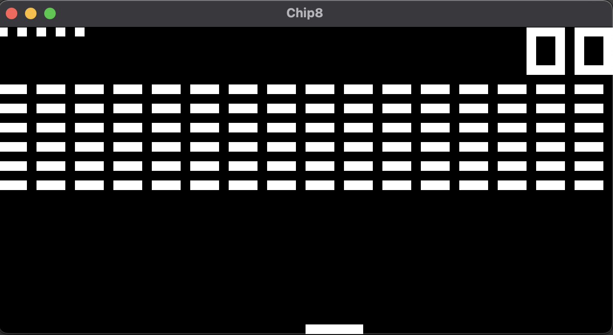
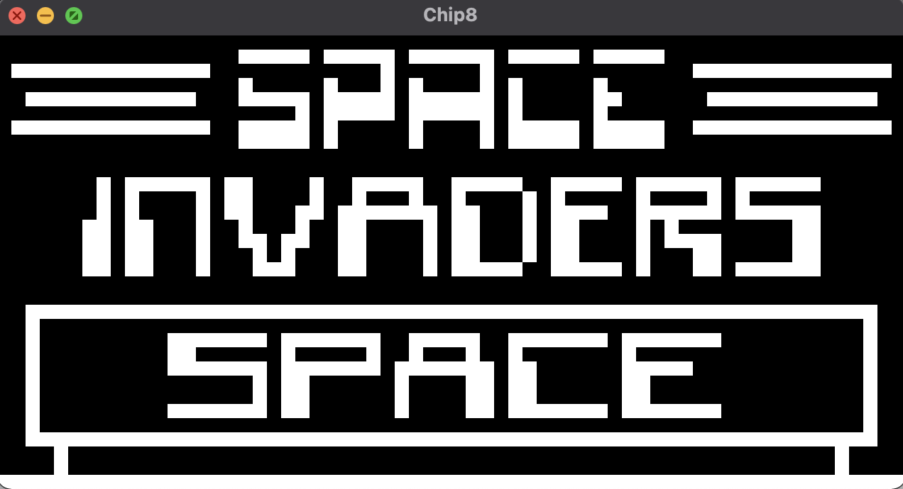
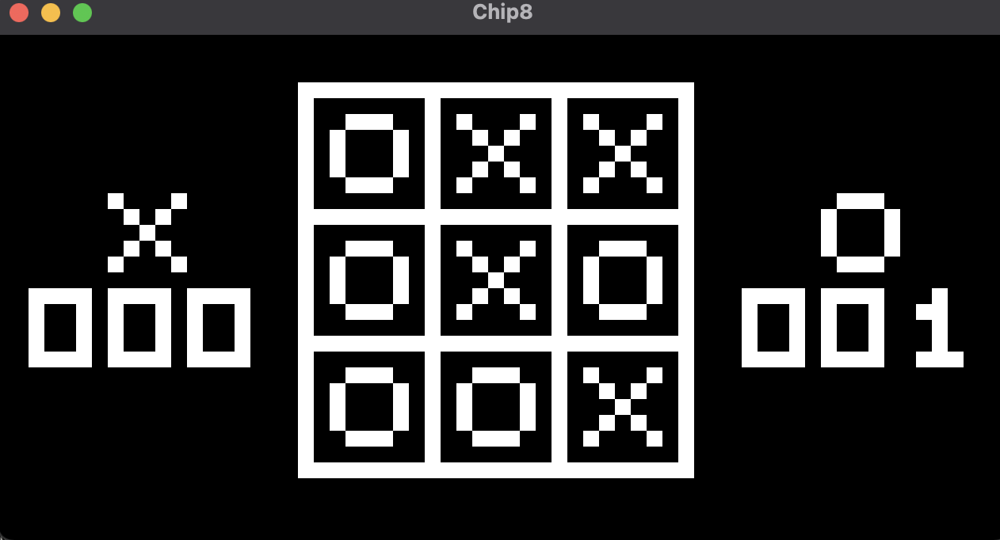

# chip8-rust

<div>



</div>

CHIP-8 emulator built in Rust.

- All 34 CHIP-8 instructions (SUPER CHIP instructions are not supported)
- Sound support by sinusoidal wave beep

## How to run

Rom files are not included in this repository. You can download them from e.g.:

- [Chip-8 Games Pack - Chip-8 ROM - Zophar's Domain](https://www.zophar.net/pdroms/chip8/chip-8-games-pack.html)

```shell
$ git clone https://github.com/johnmanjiro13/chip8-rust.git
$ cd chip8-rust
$ cargo run -- path/to/ROM_FILE
```

## Keyboard mapping

The CHIP-8 keys in the top are mapped to the corresponding keys of a normal keyboard in the bottom.

<div>
  <table>
    <tr>
      <td>1</td>
      <td>2</td>
      <td>3</td>
      <td>C</td>
    </tr>
    <tr>
      <td>4</td>
      <td>5</td>
      <td>6</td>
      <td>D</td>
    </tr>
    <tr>
      <td>7</td>
      <td>8</td>
      <td>9</td>
      <td>E</td>
    </tr>
    <tr>
      <td>0</td>
      <td>A</td>
      <td>A</td>
      <td>F</td>
    </tr>
  </table>

  <table>
    <tr>
      <td>7</td>
      <td>8</td>
      <td>9</td>
      <td>0</td>
    </tr>
    <tr>
      <td>U</td>
      <td>I</td>
      <td>O</td>
      <td>P</td>
    </tr>
    <tr>
      <td>J</td>
      <td>K</td>
      <td>L</td>
      <td>;</td>
    </tr>
    <tr>
      <td>M</td>
      <td>,</td>
      <td>.</td>
      <td>/</td>
    </tr>
  </table>
</div>
